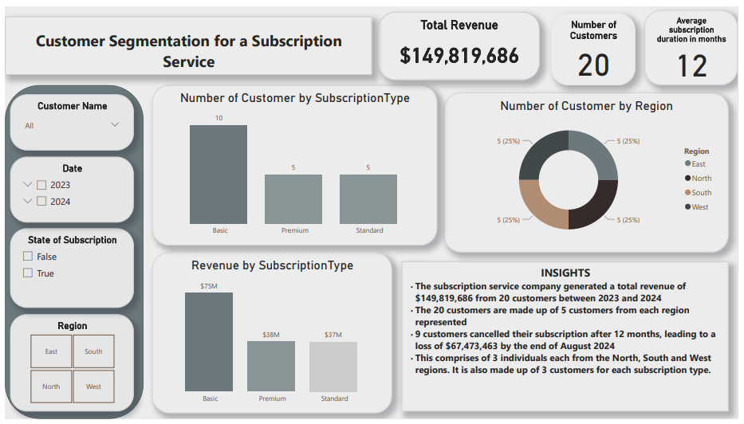

## PROJECT TITLE: Customer Segmentation for a Subscription Service

### PROJECT OUTLINE
1. [Project Overview](#project-overview)
2. [Data Sources](#data-sources)
3. [Tools Used](#tools-used)
4. [Data Cleaning and Preparation](#data-cleaning-and-preparation)
5. [Exploratory Data Analysis](#exploratory-data-analysis)
6. [Data Analysis](#data-analysis)
7. [Data Visualization](#data-visualization)
8. [Inferences](#inferences)
9. [Conclusion](#conclusion)

### Project Overview
The aim of this project is to analyze the given customer dataset for a subscription service in order to identify customer segments based on the available subscription types and identify 
trends in cancellations and renewals. 

### Tools Used
- Microsoft Excel: For data cleaning, creating pivot tables and charts
- SQL: For data manipulation, data retrieval and data analysis
- PoweBI:  Data analysis, visualization and storytelling

### Data Cleaning and Preparation
- Data loading and inspection
- Data cleaning amd removal of duplicates


### Exploratory Data Analysis
- What is the total number of customers from each region?
- What is the most popular subscription type by the number of customers.
- Find customers who canceled their subscription within 6 months.
- Calculate the average subscription duration for all customers.
- Find customers with subscriptions longer than 12 months.
- What is the total revenue by subscription type?
- Fnd the top 3 regions by subscription cancellations.
- Find the total number of active and canceled subscriptions.
- What is the total revenue by region?
- Average revenue per customer
- What is the average revenue by Subscription type?

 ### Data Analysis
- What is the total number of customers from each region?

```
SQL
SELECT Region, COUNT(DISTINCT CustomerID) AS Customer_Per_Region FROM [dbo].[LITA PROJECT 2 DATASET]
GROUP BY Region
```

```
Excel
=COUNTIF(C:C,"North")
=COUNTIF(C:C,"South")
=COUNTIF(C:C,"West")
=COUNTIF(C:C,"East")
```

- What is the most popular subscription type by the number of customers?
```
SELECT TOP 1 SubscriptionType, COUNT( DISTINCT CustomerID) AS Number_of_Customers FROM [dbo].[LITA PROJECT 2 DATASET]
GROUP BY SubscriptionType
ORDER BY Number_of_Customers DESC
```

- Find customers who canceled their subscription within 6 months.
```
SELECT CustomerID,  DATEDIFF(MONTH, SubscriptionStart, SubscriptionEnd) AS Subscription_Duration
FROM [dbo].[LITA PROJECT 2 DATASET]
WHERE DATEDIFF(MONTH, SubscriptionStart, SubscriptionEnd) <= 6
```

- Calculate the average subscription duration for all customers.
```
SELECT AVG(DATEDIFF(MONTH, SubscriptionStart, SubscriptionEnd)) AS Average_Subscription_Duration
FROM [dbo].[LITA PROJECT 2 DATASET]
WHERE SubscriptionEnd IS NOT NULL
```

- Find customers with subscriptions longer than 12 months.
```
SELECT CustomerID,  DATEDIFF(MONTH, SubscriptionStart, SubscriptionEnd) AS Subscription_Duration FROM [dbo].[LITA PROJECT 2 DATASET]
WHERE DATEDIFF(MONTH, SubscriptionStart, SubscriptionEnd) > 12
```
 
- What is the total revenue by subscription type?
```
SQL
SELECT SubscriptionType, SUM(Sum_of_Revenue) AS Total_Revenue FROM [dbo].[LITA PROJECT 2 DATASET]
GROUP BY SubscriptionType
```

```
Excel
=SUMIF(D:D,"Basic",H:H)
=SUMIF(D:D,"Premium",H:H)
=SUMIF(D:D,"Standard",H:H)
```
- Fnd the top 3 regions by subscription cancellations.
```
SELECT TOP 3 Region, COUNT(*) AS Number_of_Cancellations FROM [dbo].[LITA PROJECT 2 DATASET]
WHERE Canceled = 1
GROUP BY Region
ORDER BY Number_of_Cancellations DESC
```
-  Find the total number of active and canceled subscriptions.
```
SELECT COUNT(Canceled) AS Active_Subscriptions FROM [dbo].[LITA PROJECT 2 DATASET]
WHERE Canceled = 0 

SELECT COUNT(Canceled) AS Cancelled_Subscriptions FROM [dbo].[LITA PROJECT 2 DATASET]
WHERE Canceled = 1
```

```
ALTER TABLE [dbo].[LITA PROJECT 2 DATASET]
ADD State_of_Subscription varchar(50)

UPDATE [dbo].[LITA PROJECT 2 DATASET]
SET State_of_Subscription = CASE
WHEN Canceled = 1 THEN 'Canceled'
ELSE 'Active'
END;

SELECT COUNT(State_of_Subscription) AS Canceled_Subscription FROM [dbo].[LITA PROJECT 2 DATASET]
WHERE Canceled = 1

SELECT COUNT(State_of_Subscription) AS Active_Subscription FROM [dbo].[LITA PROJECT 2 DATASET]
WHERE Canceled = 0
```

- What is the total revenue by region?
```
Excel
= SUMIF(Table1[[#All],[Region]],"North",Table1[[#All],[Sum of Revenue]])
= SUMIF(Table1[[#All],[Region]],"South",Table1[[#All],[Sum of Revenue]])
= SUMIF(Table1[[#All],[Region]],"East",Table1[[#All],[Sum of Revenue]])
= SUMIF(Table1[[#All],[Region]],"West",Table1[[#All],[Sum of Revenue]])
```

- What is the average revenue by Subscription type?
 ```
Excel
=AVERAGEIF(Table1[[#All],[SubscriptionType]],"Basic",Table1[[#All],[Sum of Revenue]])
=AVERAGEIF(Table1[[#All],[SubscriptionType]],"Premium",Table1[[#All],[Sum of Revenue]])
=AVERAGEIF(Table1[[#All],[SubscriptionType]],"Standard",Table1[[#All],[Sum of Revenue]])
```

- Average revenue per customer
```
Excel
=AVERAGE(Table1[[#All],[Sum of Revenue]])/COUNT(Table1[CustomerID])
```

### Data Visualization


### Inferences
1. The subscription service company generated a total revenue of
$149,819,686 from 20 customers between 2023 and 2024
2. The 20 customers are made up of 5 customers from each region
represented
3. 9 customers cancelled their subscription after 12 months, leading to a
loss of $67,473,463 by the end of August 2024
4. This comprises of 3 individuals each from the North, South and West
regions. It is also made up of 3 customers for each subscription type.

### Conclusion
The analysis of customer segmentation for the subscription service shows an overall customer preference for the Basic subscription type and that location is not a determining factor in the use of the subcription service.

Important findings are:
1. 50% of the customers use the Basic subscription type and account for 50% of the total revenue.
2. There was an equal number of customer from each region.
3. No customer subscribes for the service beyong 12 months at a go.

### Limitations
1. Limited information on reasons for customers choice
2. Small sample size
